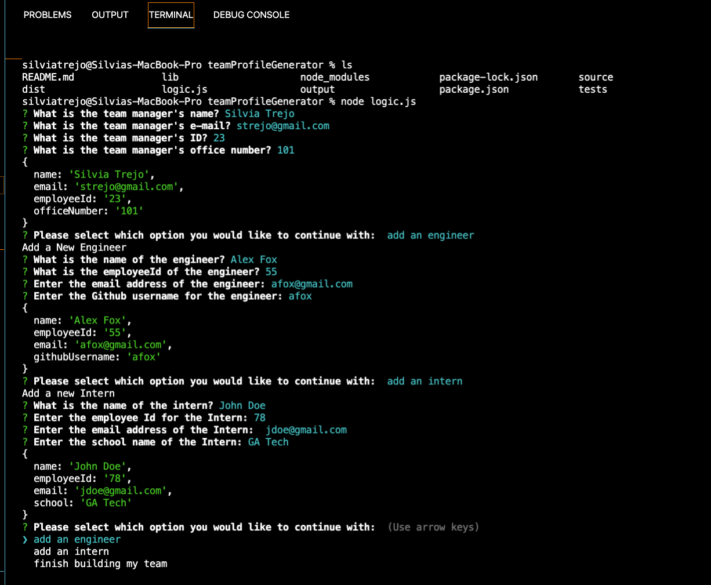
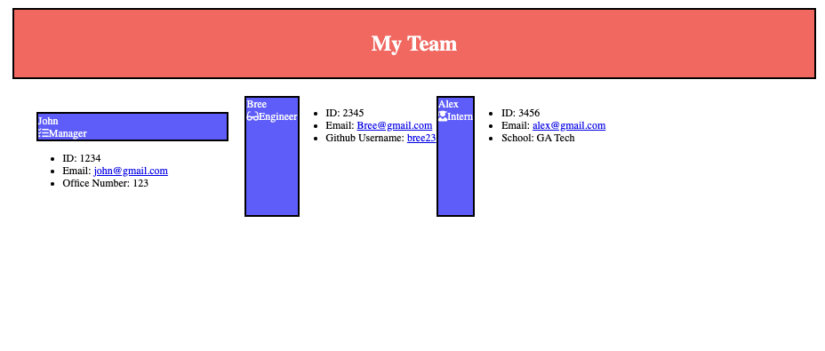

# teamProfileGenerator
[Description](#Description)
[Installation](#Installation)
[Usage](#Usage)
[License](#License)
[Deployment](#Deployment)
[Screenshots](#Screenshots)

## Description

This project takes in information about an engineering team to generate an HTML webpage that displays a brief summary of each team member.

## Installation

To install the program, you can clone the repo. Then use the terminal to initiate the program by using the command npm init. Followed by the installation of inquierer by using the command npm install inquirer. Finally to run the program in the terminal you can use node logic.js into the command line. The program will begin and prompt you for your team's information.

## Usage

Respond to the the prompts after initiating the program. Then, the program will create a unique HTML file for your team. 

## License

This application is rendered under MIT.

## Deploymet

Video Link:

Repo Link: [https://github.com/sytrejo/teamProfileGenerator](https://github.com/sytrejo/teamProfileGenerator)

## Screenshots

 
